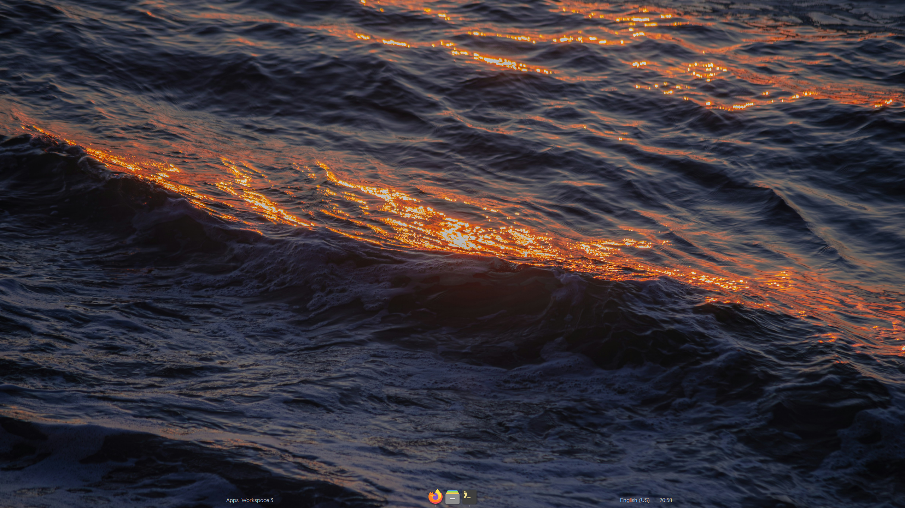

# ui

This is my eww configuration that I hacked up in a few days.

It looks something like this:



I know, super exciting. I tried to make the appearance as visually
unobtrusive and amorphous as I could, but this approach led to some
visual inconsistencies that I, at the end of the day, was too tired
to fix. To name a few:

* The highlighting of the hovered item in the app drawer (opened by
clicking on the Apps label) looks terrible
* Some shadows are cropped by just a few pixels
* The layout switcher, being made in a few hours, is pretty much a
placeholder rather than what I wanted it to be
* The dock icon indicators lack extra visual care

There's probably more that I forgot to mention, but if you still want
to use this for some reason despite my numerous attempts to stray your
interest away, the prerequisites are as follows:

## Prerequisites

* eww v>=0.5.0
* mango v>=0.17.2
* py3-gobject
* Fonts: Iosevka Term and Quicksand
* Icons: Papirus

Your mangowm config must include an `xkb_rules_layout` option with atleast
one value, for example:

```conf
xkb_rules_layout=us,ru,pt
```

## Notes

Originally I didn't even intend to release this, but as I was growing
progressively more tired of the numerous problems that I was encountering
([ahem...](https://github.com/elkowar/eww/issues/1457)), I decided that
it would be better to not let the effort go to waste and chose to put it
online so future me or other people could reference the code (even though
it's definitely not the best).

That was a lot of words.
